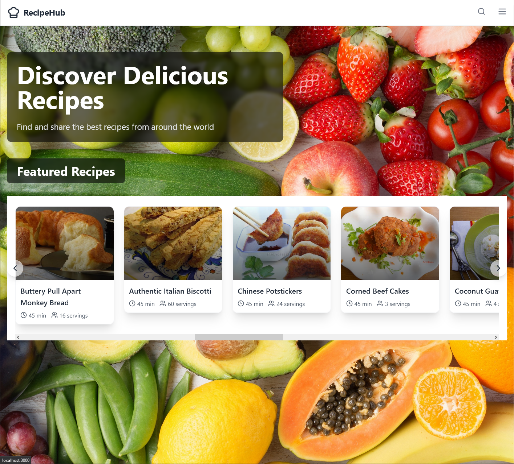

  # RecipeHub

A full-stack recipe discovery app. Browse featured recipes, search by dish or by the ingredients you already have, read step-by-step instructions, and build a printable shopping list from any recipe.

Built with **Spring Boot**, **React** and **MySQL** on top of the [Spoonacular API](https://spoonacular.com/food-api).



## About this project

RecipeHub was built by a team of six as a university software engineering project in autumn 2024.

My main contributions:

- **Backend architecture.** Split the backend into a recipe service and a dedicated Spoonacular API client service, and reworked the API endpoints and response models.
- **Frontend structure.** Rebuilt the homepage into hero and recipe sections backed by custom React hooks for API calls, and refactored the recipe cards, carousel and detail page.
- **Search.** Added search-type options and wired complex search into the navbar search bar.
- **Docker and testing.** Containerised the app with Docker Compose and wrote backend and frontend tests.
- **Repository and docs.** Set up the branch structure and wrote the setup documentation.

## Features

- A homepage carousel of featured recipes
- Search by dish name, or by ingredients you have on hand
- Recipe pages with ingredients and parsed step-by-step instructions
- Shopping list: send a recipe's ingredients to a list, add or remove items, and print it
- Server-side caching and rate limiting to stay within Spoonacular's free tier

## Tech stack

| Layer    | Technology                                   |
|----------|----------------------------------------------|
| Frontend | React 18, React Router, Tailwind CSS         |
| Backend  | Java 21, Spring Boot 3.4, Spring Data JPA, WebClient |
| Database | MySQL 8                                      |
| Testing  | JUnit, Mockito, Jest, React Testing Library  |
| Tooling  | Docker Compose, Maven, Nix dev shell         |

## How it works

```
React (localhost:3000)
   │  REST
   ▼
Spring Boot API (localhost:8080)
   │  in-memory cache + rate limiter
   ▼
Spoonacular API
```

The backend sits between the frontend and Spoonacular, so the API key never reaches the browser. Recipe responses are cached in memory for a short time, and a per-minute and per-day limiter keeps usage within the free plan. MySQL is connected through Spring Data JPA.

## Getting started

You'll need a free Spoonacular API key from [spoonacular.com/food-api](https://spoonacular.com/food-api).

### Run with Docker

The only requirement is Docker.

```bash
git clone https://github.com/travisdotdev/recipehub.git
cd recipehub
export SPOONACULAR_API_KEY=your-key
docker compose up --build
```

- Frontend: http://localhost:3000
- API: http://localhost:8080/api/recipes

### Run locally for development

Requirements: Java 21, Maven, Node.js 18+ and Docker (for MySQL). With Nix, `nix develop` (or `direnv allow`) provides the toolchain.

```bash
export SPOONACULAR_API_KEY=your-key

# Database
docker compose up -d mysql

# Backend (port 8080)
cd backend
mvn spring-boot:run

# Frontend (port 3000), in a second terminal
cd frontend
npm install
npm start
```

## Tests

```bash
# Frontend
cd frontend
npm test

# Backend (needs the MySQL container running)
cd backend
mvn test
```

## API

Recipes, under `/api/recipes`:

| Method | Path                         | Description                             |
|--------|------------------------------|-----------------------------------------|
| GET    | `/featured`, `/popular`, `/latest`, `/random` | Recipe lists for the homepage |
| GET    | `/complexSearch`             | Search by query                         |
| GET    | `/searchByIngredients`       | Recipes that use the given ingredients  |
| GET    | `/{id}`, `/{id}/information` | Full recipe details                     |
| GET    | `/{id}/ingredients`          | Ingredient list                         |
| GET    | `/{id}/instructions`         | Parsed step-by-step instructions        |

Shopping list, under `/shoppinglist`:

| Method | Path                          | Description          |
|--------|-------------------------------|----------------------|
| GET    | `/items`                      | List items           |
| POST   | `/add`                        | Add an item          |
| PUT    | `/updateQuantity/{itemName}`  | Change a quantity    |
| DELETE | `/delete/{itemName}`          | Remove an item       |

## Project structure

```
recipehub/
├── backend/                 Spring Boot API
│   └── src/main/java/.../
│       ├── controller/      REST endpoints
│       ├── service/         Business logic and Spoonacular client
│       ├── entity/          JPA entities
│       ├── repository/      Data access
│       ├── dto/             API response models
│       └── config/          Spoonacular, WebClient and CORS config
├── frontend/                React app
│   └── src/
│       ├── components/      Navbar, recipe cards, carousels
│       ├── pages/           Home, Search, Recipe detail, Shopping list
│       ├── hooks/           Data-fetching hooks
│       └── services/        API client
├── docker-compose.yml       MySQL, backend and frontend
└── flake.nix                Nix dev shell
```
